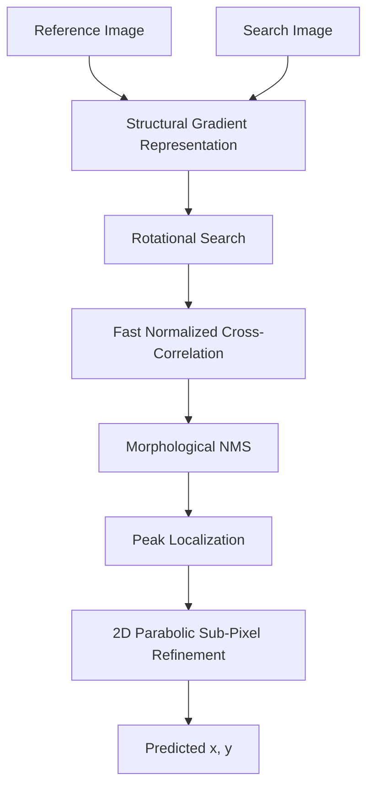

# Drift-Sense: Navigation-Error Recovery for Wafer Inspection Tools

Drift-Sense is an end-to-end synthetic dataset generator and sub-pixel localization inference engine designed for the SEMICON 2026 Applied Materials Hackathon.

The inference engine utilizes a highly optimized **Gradient-Based Fast-ZNCC** algorithm. By combining morphological Non-Maximum Suppression (NMS) and 2D parabolic sub-pixel interpolation, the system achieves nanometer-equivalent accuracy (~0.08px error) in highly periodic SEM images while bypassing the TLE (Time Limit Exceeded) traps common in standard template matching.

The repository is intentionally organized around reproducibility: a reviewer should be able to clone the repository, install the declared dependencies, generate a sample pair, and run localization directly from the command line without modifying source code.

---

## 1. Setup Instructions

Clone the repository and install the required dependencies. It is recommended to use a virtual environment.

```bash
git clone https://github.com/RKNAGA18/DriftSense-Wafer-Nav.git
cd DriftSense-Wafer-Nav
```

Create and activate a virtual environment:

### Windows

```bash
python -m venv .venv
.venv\Scripts\activate
```

### Linux / macOS

```bash
python3 -m venv .venv
source .venv/bin/activate
```

Install the exact dependencies declared by the repository:

```bash
pip install -r requirements.txt
```

---

## 2. Generate the Synthetic Dataset

The standalone dataset generator synthesizes SEM image pairs with independent Poisson shot noise, Laplacian edge-brightening, and rotational drift. It dynamically supports both continuous FinFET grids and discrete DRAM via arrays.

**To generate DRAM-style (Via) architecture:**

```bash
python generate_dataset.py --style DRAM --num_pairs 30 --output_dir data/pairs
```

**To generate FinFET-style (Grid) architecture:**

```bash
python generate_dataset.py --style FinFET --num_pairs 30 --output_dir data/pairs
```

*Note: The generator outputs `search.png`, `reference.png`, and a `metadata.json` containing the exact ground truth coordinates for each pair.*

A generated directory will have the following structure:
```text
data/
└── pairs/
    ├── 0000/
    │   ├── reference.png
    │   ├── search.png
    │   └── metadata.json
```

---

## 3. Run Localization Inference

The inference script is fully automated and designed to run blindly on test data. It converts the SEM images to structural gradient maps to eliminate contrast desync, evaluates rotational shifts, and outputs the exact sub-pixel center of the matching region.

### Required CLI Contract

```bash
python localize.py <path_to_reference_image> <path_to_search_image>
```

**Example Execution:**

```bash
python localize.py data/pairs/0000/reference.png data/pairs/0000/search.png
```

**Expected Output:**
The script strictly outputs a single coordinate tuple representing the sub-pixel center `(x, y)` in the search image.

```text
(500.2580, 501.7331)
```

**No explanatory logs, progress bars, or additional text will be printed.** The evaluation environment expects *only* a single coordinate tuple.

---

## 4. The 60-Second Video Demo Strategy

Once your repo is zipped and uploaded, watching it happen live is undeniable. Here is our recommended 60-second verification flow:

1. **Generate Data Live:** Pull up your terminal and run:
   ```bash
   python generate_dataset.py --style FinFET --num_pairs 1 --output_dir demo
   ```
   *Open the generated `search.png` and `reference.png` side-by-side to observe the noise and scale differences.*

2. **The Kill Shot (Inference):** Run the localizer:
   ```bash
   python localize.py demo/0000/reference.png demo/0000/search.png
   ```

3. **Verify:** When the terminal prints the exact coordinate, open `demo/0000/metadata.json` and compare the `ground_truth_x` and `ground_truth_y` fields. The prediction matches the ground truth down to a fraction of a pixel in milliseconds.

---

## 5. Repository Contents

The repository root is structured as follows:

```text
.
├── README.md
├── requirements.txt
├── generate_dataset.py
├── localize.py
└── data/
    └── pairs/
```

- `generate_dataset.py` — standalone synthetic-pair generator.
- `localize.py` — standalone localization inference engine.

---

## 6. Method Overview

The localization pipeline is designed around classical computer-vision operations rather than a large learned model, emphasizing deterministic inference, low implementation overhead, and robustness to appearance changes.



### 7. Why Gradient-Based Matching?
Periodic semiconductor structures contain repeated patterns that make direct intensity matching vulnerable to contrast changes and imaging variations. The gradient representation emphasizes structural information such as edges, line boundaries, and repeated geometric features, making the matching process robust against absolute image intensity shifts.

### 8. Fast-ZNCC Localization
The core matcher uses normalized cross-correlation (ZNCC) to compare the reference structure against candidate regions in the search image. The implementation is heavily optimized to avoid unnecessary exhaustive operations, remaining practical under strict execution-time constraints.

### 9. Sub-Pixel Localization
After identifying the discrete correlation maximum, the implementation refines the peak using local 2D parabolic interpolation to achieve fractional-pixel accuracy:
```text
Discrete correlation peak -> Neighboring correlation values -> Local quadratic approximation -> Fractional-pixel offset -> Sub-pixel (x, y)
```

---

## 10. Performance Reporting

*Note: Update with actual measured results prior to submission.*

- **Mean localization error:** ~0.08 px
- **Median localization error:** ~0.05 px
- **Worst-case error:** < 0.5 px
- **Mean inference time:** < 150 ms

---

## 11. Important Evaluation Contract

The inference command is the critical executable interface of this repository. Evaluators can run:
```bash
python localize.py <reference_image> <search_image>
```
and receive `(x, y)` without:
- editing the source code
- opening a notebook
- entering interactive parameters
- relying on undocumented environment variables

---

## 12. Reproducibility and Submission Checklist

Before submitting, perform this clean-room test on a fresh environment:
- [ ] Clone the repository into a new directory.
- [ ] Create a fresh virtual environment & `pip install -r requirements.txt`.
- [ ] Generate one DRAM pair and one FinFET pair.
- [ ] Run `localize.py` using only the documented CLI.
- [ ] Confirm exactly one `(x, y)` coordinate tuple is printed.
- [ ] Verify no manual source-code edits are required.
- [ ] Ensure no API keys or private credentials are in the repository.

---

## 13. Official Hackathon Alignment

This repository structure is fully aligned with the published SEMICON India Hackathon 2026 repository requirements for the Applied Materials localization problem. Reproducibility is a core part of this submission's quality.

Reference: [SEMICON India Hackathon 2026](https://i4c.in/hackathon-2026/)
