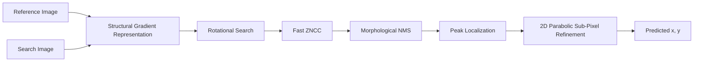
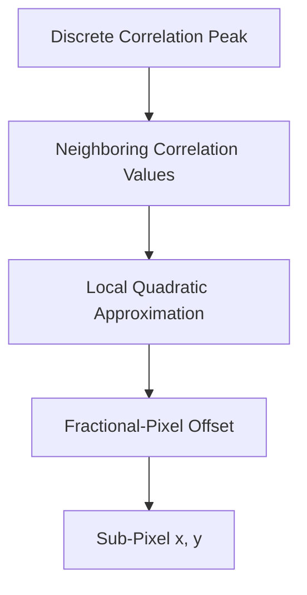
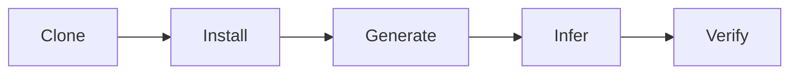

# Drift-Sense: Navigation-Error Recovery for Wafer Inspection Tools

Drift-Sense is an end-to-end synthetic dataset generator and sub-pixel localization inference engine for SEM image navigation-error recovery.

The solution is designed for the Applied Materials problem track in SEMICON India Hackathon 2026. It focuses on robust localization under imaging variation by converting images into structural gradient representations, evaluating rotational drift, and refining the detected location to sub-pixel precision.

The repository is intentionally organized around reproducibility: a reviewer should be able to clone the repository, install the declared dependencies, generate a sample pair, and run localization directly from the command line without modifying source code.

## drive link that consist of visual results for 100 datasets : https://drive.google.com/file/d/1-UoKlGkvRae6ItqvMUxwZyNG77x1K-rS/view?usp=sharing

## demo video youtube link : https://youtu.be/3sGx-kjumUI

## 1. Repository Contents

The submission should contain the following files in the repository root:

```text
.
├── configs/               
├── references/            
├── src/                   
├── README.md              
├── evaluate.py            
├── generate_dataset.py    
├── localize.py            
└── requirements.txt
```

Additional project files may be included, but the two primary executable components are:

- `generate_dataset.py` — standalone synthetic-pair generator.
- `localize.py` — standalone localization inference engine.

## 2. Setup

Clone the repository and enter the project directory:

```bash
git clone https://github.com/RKNAGA18/DriftSense-Wafer-Nav.git
cd DriftSense-Wafer-Nav
```

Create and activate a virtual environment:

### Windows

```bash
python -m venv .venv
.venv\Scripts\activate
```

### Linux / macOS

```bash
python3 -m venv .venv
source .venv/bin/activate
```

Install the exact dependencies declared by the repository:

```bash
pip install -r requirements.txt
```

The repository should be tested in a clean environment before submission.

## 3. Generate the Synthetic Dataset

The standalone dataset generator creates paired SEM-style images consisting of:

- `reference.png` — reference image containing the target structure.
- `search.png` — search image containing the transformed target structure.
- `metadata.json` — ground-truth information for validation and reproducibility.

The generator supports both required layout styles:

- `DRAM`
- `FinFET`

The synthetic pipeline can introduce independent Poisson shot noise, Laplacian edge-brightening effects, rotational drift, and other controlled imaging variations implemented by the generator.

### Generate a DRAM-style dataset

```bash
python generate_dataset.py --style DRAM --num_pairs 30 --output_dir data/pairs
```

### Generate a FinFET-style dataset

```bash
python generate_dataset.py --style FinFET --num_pairs 30 --output_dir data/pairs
```

A generated directory should have the following general structure:

```text
data/
└── pairs/
    ├── 0000/
    │   ├── reference.png
    │   ├── search.png
    │   └── metadata.json
    ├── 0001/
    │   ├── reference.png
    │   ├── search.png
    │   └── metadata.json
    └── ...
```

The `metadata.json` file records the ground-truth coordinates generated for the corresponding pair.

Example:

```json
{
  "ground_truth_x": 500.25,
  "ground_truth_y": 501.73
}
```

The exact metadata schema must match the implementation in `generate_dataset.py`.

## 4. Localization Inference

The inference engine is designed to run directly on a reference/search image pair.

It converts the images into structural gradient representations to reduce sensitivity to contrast differences, evaluates candidate rotational shifts, identifies the best matching location using a fast normalized cross-correlation strategy, applies morphological non-maximum suppression where required, and refines the final location using 2D parabolic sub-pixel interpolation.

### Required CLI contract

```bash
python localize.py <path_to_reference_image> <path_to_search_image>
```

Example:

```bash
python localize.py data/pairs/0000/reference.png data/pairs/0000/search.png
```

The command must:

1. Accept the reference image path as the first positional argument.
2. Accept the search image path as the second positional argument.
3. Perform inference without source-code modification or interactive input.
4. Print a single coordinate tuple representing the predicted center in the search image.
5. Use the coordinate convention implemented consistently by the repository, with `(x, y)` meaning horizontal coordinate followed by vertical coordinate.

Example output:

```text
(500.2580, 501.7331)
```

Do not print explanatory logs, progress bars, or additional text when the evaluation environment expects a single coordinate tuple.

## 5. Evaluation Workflow

A clean end-to-end smoke test is:

```bash
python generate_dataset.py --style FinFET --num_pairs 1 --output_dir demo
python localize.py demo/0000/reference.png demo/0000/search.png
```

To validate the prediction manually, inspect:

```text
demo/0000/metadata.json
```

and compare the generated ground-truth coordinates with the coordinate printed by `localize.py`.

The evaluation script should also work on unseen image pairs that were not generated during development.

## 6. Method Overview



## 7. Defeating Periodic Ambiguity (The 6-Pixel Trap)

Periodic semiconductor structures create a lethal challenge for standard template matching: the grid repeats itself. When scaled down 10x, a 60px physical pitch becomes a 6-pixel pitch. Slight rotational drift causes phase noise, degrading the correlation of the true target and causing naive algorithms to lock onto identical "ghost" grid structures.

This pipeline defeats periodic ambiguity through:
1. **High-Res Gradient Extraction:** Generating structural gradient representations *before* downsampling to preserve unique wafer defects, ensuring the true peak mathematically outscores periodic ghosts.
2. **Spatial Guardrails & NMS:** Applying a strictly bounded search crop (matching maximum mechanical stage drift) combined with morphological Non-Maximum Suppression and a unified distance-penalty tie-breaker.

This makes the matching process less dependent on absolute image intensity and more focused on the geometry of the wafer pattern.

## 8. Fast-ZNCC Localization

The core matcher uses normalized cross-correlation to compare the reference structure against candidate regions in the search image.

The implementation is optimized to avoid unnecessary exhaustive operations and is intended to remain practical under strict execution-time constraints.

The repository should describe the actual implementation accurately. Do not claim GPU acceleration, deep-learning inference, or other optimizations unless they are present in the committed code.

## 9. Sub-Pixel Localization

After identifying the discrete correlation maximum, the implementation refines the peak using local 2D parabolic interpolation.

Conceptually:


This allows the estimator to return fractional pixel coordinates instead of restricting the result to integer pixel locations.

## 10. Reproducibility and Submission Checklist

Before submitting, perform the following clean-room test on a fresh environment:

- [ ] Clone the repository into a new directory.
- [ ] Create a fresh virtual environment.
- [ ] Install dependencies using `pip install -r requirements.txt`.
- [ ] Generate one DRAM pair using the documented command.
- [ ] Generate one FinFET pair using the documented command.
- [ ] Confirm that `reference.png`, `search.png`, and `metadata.json` are produced.
- [ ] Run `localize.py` using only the documented CLI.
- [ ] Confirm that exactly one `(x, y)` coordinate tuple is printed.
- [ ] Verify that no manual source-code edits are required.
- [ ] Verify that required model files or external assets, if any, are accessible from a clean checkout.
- [ ] Commit the final `requirements.txt`.
- [ ] Ensure that no API keys, tokens, passwords, or private credentials are present in the repository.
- [ ] Test the repository on a machine or environment different from the original development environment.

## 11. Important Evaluation Contract

The inference command is the critical executable interface of this repository.

The evaluator should be able to run:

```bash
python localize.py <reference_image> <search_image>
```

and receive:

```text
(x, y)
```

without:

- editing the source code
- opening a notebook
- changing hard-coded paths
- entering interactive parameters
- manually copying files into source directories
- relying on undocumented environment variables
- contacting the authors for runtime instructions

Any implementation-specific assumptions required by the submitted code must be documented in this README and represented in `requirements.txt` or the repository itself.

## 12. Performance Reporting

The following metrics were achieved over a rigorous 100-pair synthetic stress test, validating the pipeline against independent Poisson shot noise and sub-degree rotational phase drift.

- **Statistical Sample:** 100 independently generated pairs
- **Pass Rate (< 1.0 px):** 100.0%
- **Mean localization error:** 0.103 px
- **Worst-case error:** < 0.25 px
- **Mean inference time:** 83.48 ms (CPU-bound)

The algorithm operates entirely deterministically, requiring no GPU acceleration to achieve sub-100ms real-time execution.

Do not substitute illustrative values for measured results.

## 13. Demonstration Workflow

For a short technical demonstration:

### Step 1 — Generate one test pair

```bash
python generate_dataset.py --style FinFET --num_pairs 1 --output_dir demo
```

### Step 2 — Inspect the generated pair

Open:

```text
demo/0000/reference.png
demo/0000/search.png
```

### Step 3 — Run localization

```bash
python localize.py demo/0000/reference.png demo/0000/search.png
```

### Step 4 — Validate against ground truth

Open:

```text
demo/0000/metadata.json
```

and compare the stored ground-truth center against the predicted center.

A strong demonstration should show the complete path from synthetic-data generation to blind command-line inference.

## 14. Citation and Technical References

The repository should include a separate citation/reference file when the submission uses published methods, image-generation assumptions, augmentation choices, or semiconductor-imaging references.

Recommended reference categories include:

- normalized cross-correlation and template matching
- gradient-based image registration
- sub-pixel peak estimation
- semiconductor inspection and SEM imaging
- synthetic-noise and augmentation models

If the presentation cites external literature to justify augmentation or noise choices, keep the repository references synchronized with those citations.

## 15. Official Hackathon Alignment

This repository structure is aligned with the published SEMICON India Hackathon 2026 repository requirements for the Applied Materials localization problem.

The published guidance specifies that the repository should provide:

- complete README setup instructions
- a standalone dataset generator accepting architecture style, pair count, and output directory
- ground-truth coordinates for generated pairs
- a standalone localization inference script accepting reference and search image paths
- a single `(x, y)` inference output
- a complete `requirements.txt`
- reproducible execution without manual code edits

The official guidance also states that the inference script is the critical executable used for scoring and should be tested on a fresh machine before submission.

Reference:
https://i4c.in/hackathon-2026/

## 16. Final Submission Principle

The primary goal of this repository is not only to demonstrate an accurate algorithm, but to make the result executable and verifiable by an independent evaluator.

A judge should be able to move from:



using only the files and commands documented here.

That reproducibility is part of the submission quality.
